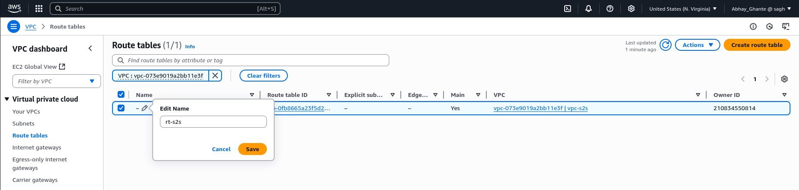
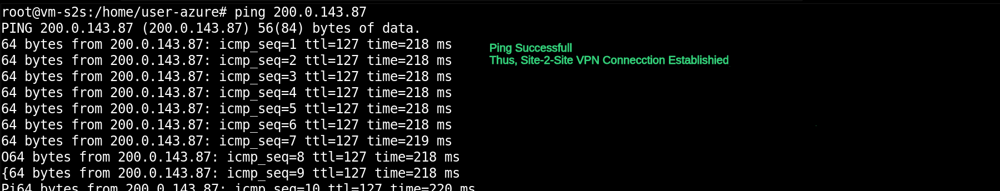

# AWS Site-to-Site VPN Connection With On-Premise Server ⛓️‍💥

This project demonstrates the implementation of a **Site-to-Site VPN connection** between AWS and an on-premises server (Simulated via Azure Cloud), creating a secure hybrid/multi-cloud architecture. This setup enables seamless communication between cloud environments while maintaining security and network isolation.

## 🏗️ Architecture Overview


The implementation creates a secure tunnel between:

- **AWS VPC**: `200.0.0.0/16` CIDR block
- **Azure VM (On-Premises Simulation)**: `100.0.0.0/16` CIDR block

## Phase 1️⃣: Azure On-Premises Server Setup

#### Step 1: Create Resource Group `rg-s2s`


#### Step 2: Deploy Virtual Machine

Deploy the VM that will simulate our on-premises server.

**Configuration Details:**

- **VM Name**: `vm-s2s`
- **Username**: `user-s2s`
- **Virtual Network**: `vnet-s2s` (100.0.0.0/16)
- **Subnet**: `subnet-s2s` (100.0.0.0/16)
- **OS**: Any Linux Machine (Amazon Linux in my case)


## Phase 2️⃣: AWS VPC Infrastructure Setup

#### Step 1: Create Virtual Private Cloud (VPC)

- VPC Name: `vpc-s2s`
- IPv4 CIDR: `200.0.0.0/16`


#### Step 2: Create Subnet

- Subnet Name: `subnet-s2s`
- VPC: `vpc-s2s`
- Subnet IPv4 CIDR: `200.0.0.0/16`


#### Step 3: Rename Route Table

Rename the automatically created route table.

- Route Table Name: `rt-s2s`
- Associated VPC: `vpc-s2s`



#### Step 4: Associate Subnet with Route Table

Link route table to our subnet `subnet-s2s` using `edit subnet association` option.


## Phase 3️⃣: VPN Gateway Configuration

#### Step 1: Create Virtual Private Gateway

- VPGW Name: `vpgw-s2s`


#### Step 2: Attach VPGW to VPC

Connect the Virtual Private Gateway to our VPC `vpc-s2s`.


#### Step 3: Update Route Table

Add routing rules to direct traffic on virtual private gateway to on-premise server.

- Destination: `100.0.0.0/16`
- Target: `Virtual Private Gateway (vpgw-s2s)`


#### Step 4: Create Customer Gateway

**Configuration Parameters:**

- **Name**: `cgw-s2s`
- **IP Address**: `[On-Prem/Azure VM Public IP]`


#### Step 5: Create Site-to-Site VPN Connection

**Configuration Parameters:**

- **Target Gateway**: `Virtual Private Gateway (vpgw-s2s)`
- **Customer Gateway**: `cgw-s2s`
- **Static IP Prefix**: `100.0.0.0/16`


#### Step 6: Download VPN Configuration

Once the VPN connection is established, download the configuration file as per the vpn client, which is `strongswan` in my case.


## Phase 4️⃣: StrongSwan VPN Client Setup

#### Step 1: Install StrongSwan

SSH into the Azure VM and install the StrongSwan client.

###### **Connect to Azure VM**:

```cmd
ssh user-s2s@[AZURE_VM_PUBLIC_IP]
```

**Install StrongSwan:**

```cmd
sudo apt update
sudo apt install strongswan -y
```


#### Step 2: Enable IP Forwarding

Configure the system to forward IP packets.

**Edit sysctl configuration:**

```cmd
sudo nano /etc/sysctl.conf
```

**Uncomment the following line:**

```cmd
net.ipv4.ip_forward = 1
```


**Save and verify changes:**

```cmd
sudo sysctl -p
```

#### Step 3: Configure VPN Tunnels

Modify the downloaded VPN configuration file with correct subnet information.

**Configuration Updates For Both Tunnel:**

- **leftsubnet**: `100.0.0.0/16` (On-Prem/Azure Network Subnet)
- **rightsubnet**: `200.0.0.0/16` (AWS VPC Subnet)


#### Step 4: Update IPsec Configuration

**Edit the IPsec configuration file:**

```cmd
sudo nano /etc/ipsec.conf
```

**Configuration changes:**

- Uncomment `uniqueids = no`
- Add updated tunnels configurations from downloaded file.


> Note: Screenshot has mistake in showing the name of subnet, leftsubnet is of Azure and rightsubnet is of AWS.

#### Step 5: Configure IPsec Secrets

Add the pre-shared keys for both tunnels given in configuration file.

**Edit IPsec secrets file:**

```cmd
sudo nano /etc/ipsec.secrets
```

**Paste keys from 4th section of each tunnel in configuration file.**


#### Step 6: Reload Strongswan & IPSec

Restart and verify services.

**Restart StrongSwan service:**

```cmd
sudo systemctl restart strongswan-starter
sudo systemctl status strongswan-starter
```

**Restart IPsec service:**

```cmd
sudo service ipsec restart
sudo service ipsec status
```


## Phase 5️⃣: Connection Verification

#### Step 1: Verify Tunnel Status On Azure

**Check the on-premise tunnel status:**

```cmd
sudo ipsec status
```


> Both the tunnels show established! 🤩

#### Step 2: Verify Tunnel Status on AWS

Check the VPN connection status in AWS VPN tunnel details.


> Both the tunnels are up! 🚀

## 📩 Ping Test

#### Step 1: Deploy Test EC2 Instance

Create an EC2 instance in the AWS VPC for connectivity testing.

**EC2 Configuration:**

- **Instance Name**: `ec2-s2s`
- **VPC**: `vpc-s2s`
- **Subnet**: `subnet-s2s`
- **Security Group**: Default or Create Custom New
- **Security Group Rules**:
  - **Target**: `All ICMP`
  - **Source**: `security-group / CIDR Block of On-Prem Server`


#### Step 2: Test Connectivity

Verify The Connection By Pinging Each Other's Private IP.




## ✅ Conclusion!

I have successfully implemented Site-to-Site VPN connection between AWS and On-Premise Infrastructure (Simulated via Azure VM) with following achievements:

- Established secure hybrid cloud connectivity
- Implemented multi-cloud networking architecture
- Demonstrated cross-cloud private communication
- Configured IPsec VPN tunnels

Also, This Setup Can Be Furthur Improved by Utilising Transit Gateway for Multi-VPC Setup.

## 📝 References

- [AWS Site-to-Site VPN Documentation](https://docs.aws.amazon.com/vpn/)
- [StrongSwan Configuration Guide](https://strongswan.org/)
- [Azure Virtual Network Documentation](https://docs.microsoft.com/en-us/azure/virtual-network/)

